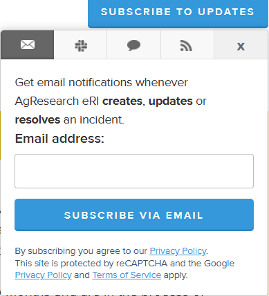
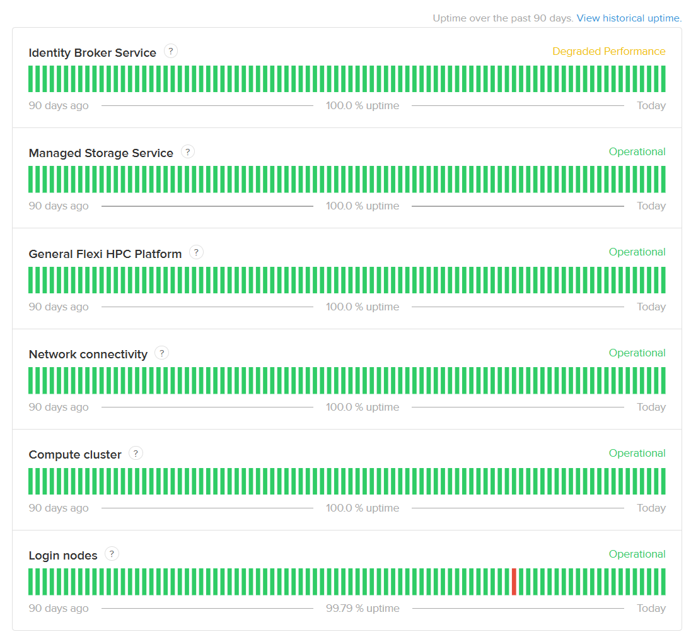

!!! note "See also"
    [NeSI wide area network connectivity](../../Getting_Started/Getting_Help/NeSI_wide_area_network_connectivity.md)

## eRI system status related notifications

System notifications for all components are listed on [agresearcheri.statuspage.io](https://agresearcheri.statuspage.io/)  
The [eri_support_docs](https://mattbixley.github.io/eri-support-docs/) homepage shows current incidents and upcoming scheduled events (based on status.nesi.org.nz).

## Subscribe to updates

To subscribe to either email or slack updates of the system click `SUBSCRIBE TO UPDATES` on the top right corner of the page
[agresearcheri.statuspage.io](https://agresearcheri.statuspage.io/)

{ width="80%" }

## Components

The status history of individual components of the system can be viewed along with past incidents

{ width="80%" }

