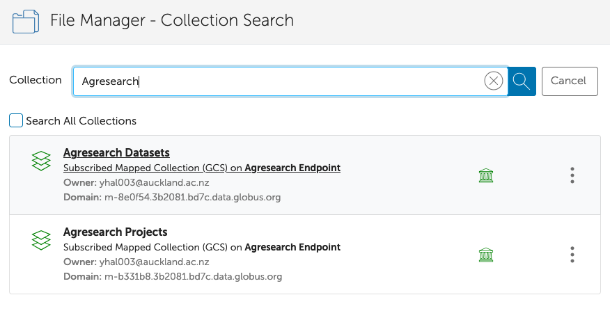
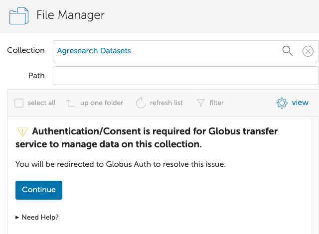
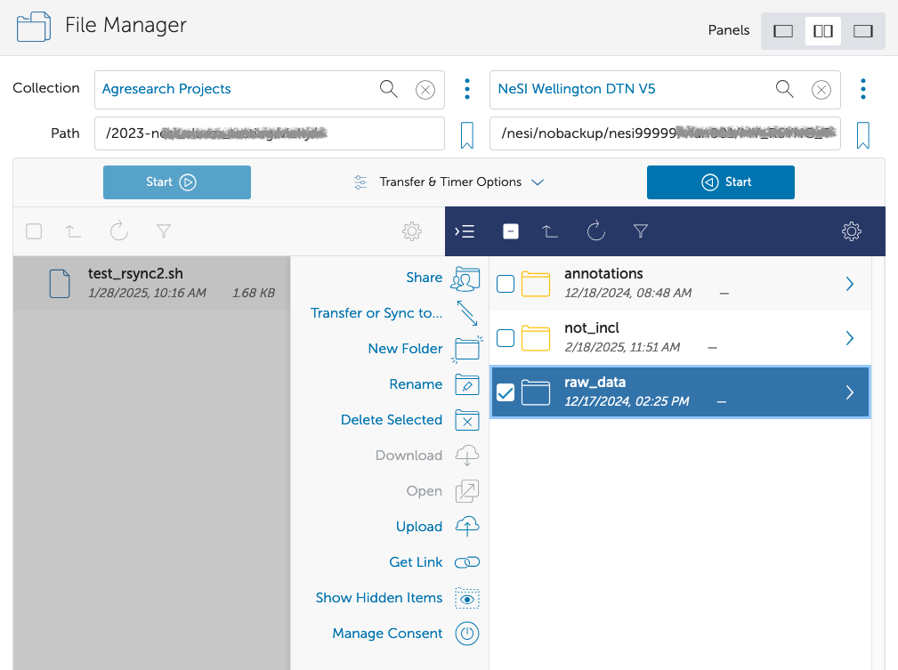

This is intended to be a quick-start guide for using Globus on eRI, for more detailed information, please see our NeSI Globus articles here: [NeSI Globus documentation](https://docs.nesi.org.nz/Storage/Data_Transfer_Services/Data_Transfer_using_Globus_V5/){:target="\_blank"}

Globus is a third-party service for transferring large amounts of data
between two Globus Data Transfer Nodes (DTNs). To use Globus to transfer
data to or from eRI, you need:

1. An eRI account
2. A Globus account
3. Access to Globus DTNs or endpoint  
    - Access to a DTN (e.g., at your home institution)
    - Personal endpoint if no DTN is available

## Globus Account

Please note that a Globus account is not the same as an eRI account. You
will need both Globus and eRI accounts in order to transfer data to or
from eRI HPC facilities.

To get a Globus account, go to <https://app.globus.org/> and sign
up using one of the available options on the page. Please note that the
"existing organizational login" is somewhat limited, if your
organisation is not listed, please sign in (sign up) using any of the
other methods.

For more detailed instructions please see [Initial Globus Sign-Up, and
your Globus
Identities](../../Storage/Data_Transfer_Services/Initial_Globus_Sign_Up-and_your_Globus_Identities.md).

## Globus Endpoint Activation

An eRI account is required in addition to a Globus account to transfer
data to or from eRI facilities.

To transfer data, between two sites, you need to have access to a DTN or
endpoint at each location. For example, one on eRI, the other to NeSI (NeSI Wellington DTN V5). You will also need the appropriate read and write permissions from where you're copying to and from.

There are currently two AgResearch eRI endpoints:

- Agresearch Datasets
- Agresearch Projects

A list of some other Institutional endpoints can be found here:
[National-Data-Transfer-Platform](../../Storage/Data_Transfer_Services/National_Data_Transfer_Platform.md).
You can also set up your own [personal
endpoint](../../Storage/Data_Transfer_Services/Personal_Globus_Endpoint_Configuration.md)
to transfer data to or from your personal computer, however,
administrative access to your computer is required

To activate the NeSI endpoint click go to
[https://app.globus.org/file-manager](https://app.globus.org/file-manager/)  and click "file manager" on the menu
bar on the left.

1. Next to "Collection", search for "Agresearch", select the endpoint of interest, then click "Continue".
2. If this is your first time logging in, or the login has timed out , you will need to authenticate to the endpoint.

## Transferring Data

To transfer data, activate your two endpoints and navigate to the
appropriate folders, then select the files or folders of interest. To
initiate the transfer, select one of the two directional arrows. In the
image below, the 'raw_data' folder is being transferred from the location
on the right (NeSI), to the location on the left (eRI).

To see the progress of the transfer, please click 'Activity' on the left
hand menu bar.

If you have any questions or issues using Globus to transfer data to or
from NeSI, 
