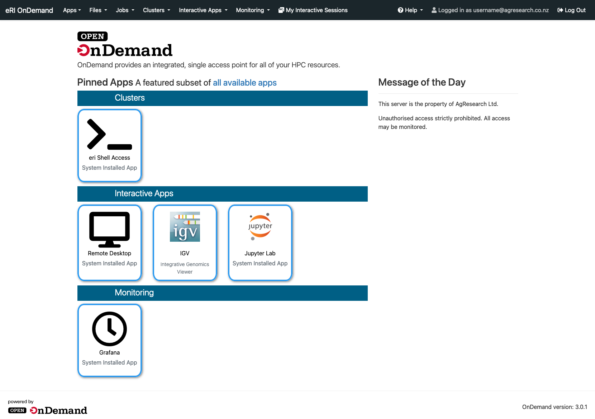

# How to connect to Open OnDemand

Open OnDemand can be described as providing access to your organisation’s computational resources via a web browser. No client software installation is required.

Start computing immediately. A simple interface makes Open OnDemand easy to learn and use. Launch on any device with a browser. 

The Open OnDemand (OOD) web interface allows AgResearch staff to access the eRI via a web browser. This article explains how to connect to it. 

## Instructions

Ensure you are connected the the AgResearch network (direct or via VPN):

Open your web browser and navigate to https://ondemand.eri.agresearch.co.nz/

Authenticate using your username@agresearch.co.nz (or email address) and password when prompted.

Find helpful links in the ‘Help’ menu on the top of the screen.

Select from the options of the top menu bar.
Apps are presented as cards so users can launch an instance in a very simple way. 
